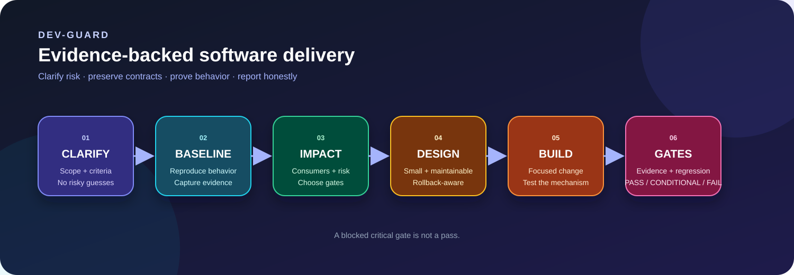

# Dev Guard



**A skeptical, evidence-driven software-development skill for safer changes.**

Dev Guard tells Codex how to work like a careful engineer: clarify decision-changing ambiguity, inspect the real baseline, map side effects, choose risk-based test gates, preserve existing contracts, and report the result honestly.

It is designed for feature work, bug fixes, refactors, code review, APIs, frontend, backend, mobile, databases, migrations, release builds, deployments, and production-impacting changes.

## What problem it solves

Fast code is not necessarily safe code. A patch can pass a narrow test while breaking a shared hook, route, schema, permission, mobile lifecycle, translation, analytics event, or deployment contract.

Dev Guard makes those hidden obligations explicit:

- ask before guessing when the missing answer could change the design;
- reproduce bugs before locking in a fix rule;
- keep changes small, local, readable, and easy to undo;
- select test gates by risk and affected surface;
- distinguish a failed test from a broken environment;
- never call a blocked or unrun check a pass;
- finish with `PASS`, `CONDITIONAL PASS`, or `FAIL` and remaining risks.

## Workflow


## Core rules

### 1. Clarify before editing

Codex should inspect local files and configuration first. If an unresolved point could change scope, architecture, data shape, user-visible behavior, compatibility, or risk, it asks one question at a time and waits before editing.

Low-risk details may be assumed only when the assumption is stated and does not change the design.

### 2. Protect the baseline

For a bug, Dev Guard expects a reproduction or a clear explanation of why reproduction is blocked. The agent should understand the mechanism before creating a permanent rule, including event order, state, focus/caret behavior, caching, retries, lifecycle, or data boundaries when relevant.

### 3. Make maintenance a feature

Dev Guard prefers the smallest coherent change that preserves existing contracts. It challenges:

- speculative abstractions;
- duplicated business rules;
- hidden global state and magic flags;
- unrelated refactors mixed into a fix;
- weak tests that only exercise implementation details;
- shortcuts that create undocumented technical debt.

### 4. Use risk-based gates

Every task has common gates. Additional gates are selected for the affected surface.

| Surface | Typical additional gates |
| --- | --- |
| Bug fix | reproduction, regression, negative/boundary case |
| Feature | unit/component, integration, critical-journey E2E |
| API | contract, authorization, validation, compatibility |
| Database | integrity, migration repeatability, rollback/recovery, performance |
| Frontend | UI states, accessibility, responsive, localization, browser |
| Mobile | lifecycle, permissions, navigation/back, install, physical device |
| Security-sensitive | auth, authorization, privacy, injection, secrets, audit |
| Release/deployment | exact artifact, config, smoke, observability, rollback |

Read [`references/test-gates.md`](references/test-gates.md) for the complete catalogue.

## Gate result vocabulary

| Status | Meaning | Release implication |
| --- | --- | --- |
| 🟢 `PASS` | Executed and passed with evidence | Can contribute to a PASS decision |
| 🔴 `FAIL` | Executed and found an unresolved defect | Required fix or explicit re-scope |
| 🟠 `BLOCKED` | Required check could not run | Not a pass; critical blockers prevent release-ready claims |
| 🟡 `NOT RUN` | Relevant check was intentionally omitted | State why and the residual risk |
| ⚪ `N/A` | Genuinely irrelevant to the task | State why |
| 🔵 `ASSUMED` | Temporary low-risk assumption | Never treat as evidence |

## Final decision

- **PASS** — required gates passed with inspectable evidence.
- **CONDITIONAL PASS** — tested scope is acceptable, but a non-code limitation remains, such as a missing device, credential, external service, or production-only check.
- **FAIL** — a required gate failed, evidence is insufficient for the claim, a defect remains, or a critical gate is blocked.

The final report must separate:

1. code defects;
2. test defects or incorrect expectations;
3. dependency/tooling failures;
4. environment, credential, service, or device blockers.

## Obsidian reporting

Small, low-risk work can end with a concise chat summary. Dev Guard creates a complete report for medium/high-risk, multi-module, migration, release, or explicitly requested work.

Reports are stored under the active vault:

```text
Dev Reports/<project-name>/<YYYY-MM-DD>-<task-slug>.md
```

Reports are Thai-first while preserving English technical terms, commands, errors, test names, paths, and identifiers. The report includes:

- scope and acceptance criteria;
- baseline and reproduction;
- impact map and risk register;
- design decision and technical-debt disclosure;
- changed files/modules;
- every selected gate with command, result, evidence, and remaining risk;
- known issues, blocked/unrun gates, rollback/recovery, and final decision;
- Mermaid flow diagrams when they improve understanding;
- a static SVG/PNG only when the visual relationship is genuinely useful.

See [`references/obsidian-report.md`](references/obsidian-report.md) for the full template and colored section conventions.

## Repository structure

```text
dev-guard/
├── SKILL.md
├── README.md
├── agents/
│   └── openai.yaml
├── references/
│   ├── obsidian-report.md
│   └── test-gates.md
└── assets/
    └── dev-guard-flow.svg
```

## Install globally

Install the repository as `dev-guard` under the global Codex skills directory. The exact installer command depends on the Codex installation, but the destination should resolve to:

```text
C:\Users\<user>\.codex\skills\dev-guard
```

After installation, invoke it explicitly with `$dev-guard`, or let implicit invocation select it for software-development tasks when the skill is enabled.

## License

This project is licensed under the [MIT License](LICENSE). You may use, modify, distribute, and reuse it, subject to preserving the copyright and license notice.
