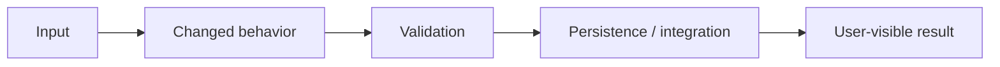

# Obsidian report format

Use this template for medium/high-risk, multi-module, release, migration, or explicitly requested work. Write Thai prose first and retain English technical terms, commands, errors, test names, file names, and identifiers.

## Destination

1. Discover the active vault from Obsidian's configuration.
2. Verify the path contains `.obsidian` or is otherwise confirmed as a vault.
3. Derive the project name from the repository root, manifest, or explicit user context.
4. Write to:

`<vault>/Dev Reports/<project-name>/<YYYY-MM-DD>-<task-slug>.md`

Do not use the project folder as the vault unless it is independently confirmed. Re-open the file after writing and verify its path and key sections.

## Frontmatter

```yaml
---
title: "<งาน>"
project: "<ชื่อโปรเจกต์>"
date: "YYYY-MM-DD"
status: "PASS | CONDITIONAL PASS | FAIL"
risk: "low | medium | high | critical"
report_type: "dev-guard"
tags:
  - dev-guard
  - project/<project-slug>
cssclasses:
  - skillloop-proposal
---
```

Use `skillloop-proposal` only when the active vault has the compatible CSS snippet. Add `skillloop-redteam` for a security-focused report only when that CSS class is available. Otherwise omit `cssclasses` and use native callouts.

## Colored section convention

When `skillloop-sections.css` or an equivalent compatible snippet is present, use colored badges in major headings:

```markdown
# <span class="section-badge section-goal">01</span> สรุปงาน
# <span class="section-badge section-strategy">02</span> Scope และ Acceptance Criteria
# <span class="section-badge section-technology">03</span> Baseline และ Impact
# <span class="section-badge section-execution">04</span> Implementation และ Test Evidence
# <span class="section-badge section-pitch">05</span> Decision และ Next Steps
```

The exact color is a presentation aid, not evidence. When CSS is unavailable, use native callouts and status markers:

```markdown
> [!success] PASS
> ตรวจแล้วด้วย `pnpm test` และผลลัพธ์ผ่านครบ

> [!warning] RISK
> ยังไม่ได้ทดสอบบน physical device เพราะไม่มีอุปกรณ์เชื่อมต่อ

> [!failure] FAIL
> พบ regression ใน critical journey

> [!info] BLOCKED
> Gate นี้รันไม่ได้เพราะ external service ไม่พร้อม
```

## Required report sections

```markdown
# <span class="section-badge section-goal">01</span> สรุปงาน

> [!abstract] Executive summary
> สรุปปัญหา สิ่งที่ทำ และผลลัพธ์ในไม่กี่ย่อหน้า

## Final decision

| Decision | PASS / CONDITIONAL PASS / FAIL |
|---|---|
| Risk | low / medium / high / critical |
| Scope | ... |

# <span class="section-badge section-strategy">02</span> Scope และ Acceptance Criteria

## In scope
- ...

## Out of scope
- ...

## Acceptance criteria
- [ ] ...

# <span class="section-badge section-technology">03</span> Baseline, Impact และ Risk

## Baseline
- Current behavior: ...
- Reproduction: ...
- Evidence: ...

## Impact map
| Surface | Consumer | Risk | Preservation check |
|---|---|---|---|
| ... | ... | ... | ... |

## Risk register
| Risk | Likelihood | Impact | Mitigation | Residual risk |
|---|---:|---:|---|---|
| ... | ... | ... | ... | ... |

## Flow



# <span class="section-badge section-execution">04</span> Design, Changes และ Test Evidence

## Design decision
- Invariant/contract preserved: ...
- Why this approach: ...
- Alternatives rejected: ...
- Technical debt introduced: none / ...

## Changed files/modules
| File/module | Change | Side-effect check |
|---|---|---|
| ... | ... | ... |

## Gate results
| Gate | Scope/method | Result | Evidence | Evidence scope | Remaining risk |
|---|---|---|---|---|---|
| Requirement/scope | ... | PASS | ... | REPO / LOCAL-ONLY | ... |
| Baseline/reproduction | ... | PASS | ... | REPO / LOCAL-ONLY | ... |
| Static quality | ... | ... | ... | REPO / LOCAL-ONLY | ... |
| Unit/integration/E2E | ... | ... | ... | LOCAL-ONLY | ... |

For the user's test-free-PR convention, add `Evidence scope: LOCAL-ONLY` when the test source or fixture is intentionally excluded from the PR. Add a `reviewability` technical-debt item under remaining risks; do not present local-only evidence as reproducible from the PR.

## Commands and observations
```text
<command>
<relevant output>
```

# <span class="section-badge section-pitch">05</span> Decision, Known Issues และ Next Steps

## Known issues
- ...

## Unrun or blocked gates
- Gate: ...
  - Status: BLOCKED / NOT RUN
  - Reason: ...
  - Risk: ...

## Remaining risks
- ...
- Reviewability debt from local-only tests: ...

## Rollback / recovery
- ...

## Final decision
> [!success] PASS
> ...
```

Replace the final callout type to match the actual decision. Never use a green callout for `CONDITIONAL PASS` or `FAIL`.

## Report quality checks

- Separate executed evidence from assumptions.
- Name exact commands and relevant output; do not paste noisy logs without interpretation.
- Link to repository files, tests, screenshots, artifacts, or logs when paths are available.
- When test files are excluded by project convention, link to local evidence if available and state that the PR itself cannot reproduce the test.
- Explain blocked environment/device/service checks and their release impact.
- End with exactly one final decision and a concise remaining-risk list.
- Prefer one useful Mermaid flow over many decorative diagrams.
